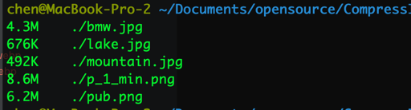
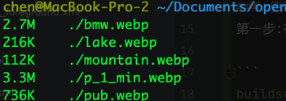
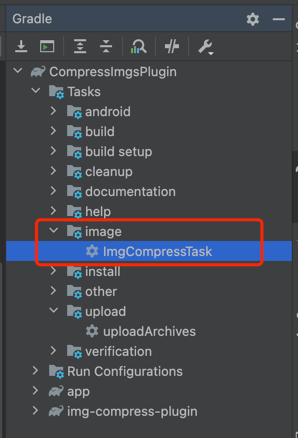
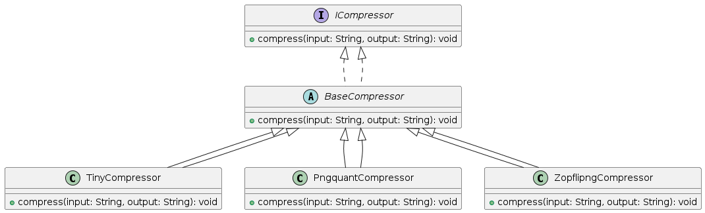

<h3>Android gradle自动化压缩图片的插件</h3>

工作原理：一键扫描项目中的资源目录，包括Drawable和Drawable-xx以及mipmap-xx的目录下的所有的png和jpg的图片<br>
然后根据配置文件，选用具体对应的压缩器，进行png或者jpg图片的压缩，压缩完成后，会自动使用谷歌提供的[cwebp](https://developers.google.com/speed/webp/docs/cwebp)的工具来进行自动转换成Android客户端最长使用的图片格式webp,从而节约图片资源的占用空间。<br>

### 压缩效果对比

- 原图<br>

- 压缩后的图<br>


### 压缩图片对比

| Origin Pic                                | Tinypng                                                             |
|-------------------------------------------|---------------------------------------------------------------------|
| Compression Type                          | Lossy                                                               |
| 500.83KB                                  | 111.01KB                                                            |
|  |  |

### 压缩效率：
- 整体图片的压缩比的话，有的高，有的低，和图像的整体元素有关系，整体有个60%-70左右的压缩率是有的，有的可以达到90%左右


### 使用方法：
第一步:在`Project`的build.gradle文件中:

```
buildscript {
    repositories {
        mavenCentral()
    }
    dependencies {
        ...
        classpath 'com.transsion.plugin:ImgCompressPlugin:1.2.1'
    }
}
...
...
//图片压缩插件配置
apply plugin: 'img-compressor'
imgCompressOpt{
    way="pngquant" //资源压缩的方式（选项:"tinypng","pngquant","zopflip"）
    test = false //设置测试模式是否开启,false表示压缩后图片直接覆盖原图,true表示会把原图及压缩图输出到测试目录(Project/ImageCompressTest)
    whiteFiles=["text_pic1.png","test_pic2.jpg"] //压缩白名单
    minSize=5 // 最小压缩文件的大小，小于这个大小的文件将被忽略
    tinyKeys=["your key"] //tinypng 服务，需要使用的key,支持多个
}

```
第二步:引入后点击`sync now`,gradle配置完毕后会显示下图`imgCompressTask`,双击即可执行,等待压缩结果即可
- 

### 最佳实践
- 引入本插件,配置测试模式test=false,初次执行`imgCompressTask`后,查看log,会打印类似日志:
    - Task finish, compressed:3 files  skip:3 Files  before total size: 951.50KB after total size: 309.67KB save size: 641.83KB
    - 通过日志可得知被压缩图片为3个,跳过图片为3个,图片压缩前后的大小比较.图片跳过的原因为图片已充分压缩,无需再压缩

- 执行task后会在project目录下生成image-compressed-info.json文件,记录了已压缩的图片信息
- 通过版本控制工具对比压缩前后图片是否失真,将失真图片(一般很少)加入白名单中,同时revert恢复原图
- 将image-compressed-info.json文件加入到版本控制,提交修改后的图片及json文件
- 在后续的版本开发中,团队中的任何人在开发过程中加入任何图片,或者等版本提测后,执行一次task即可压缩新版本引入的图片,旧版本的图片保持不变,也不会出现团队成员重复压缩的情况

### 代码主要关系图，可以二次开发，根据需求


### 问题解答

1 多次执行压缩Task,图片是否会重复被压缩？
- 答：不会。图片每次压缩后，会在项目的根目录下面的“[image-compressed-info.json](image-compressed-info.json)”,记录md5，只要文件内容未发生改变，那么就不会重复压缩。
```
[
    {
        "preSize": 9033989,
        "outputPath": "/app/src/main/res/drawable/p_1_min.webp",
        "md5": "8968df868e9342bf7be1961fe5daa845",
        "ratio": "26%",
        "compressedSize": 2398770,
        "path": "/app/src/main/res/drawable/p_1_min.png"
    },
    {
        "preSize": 500834,
        "outputPath": "/app/src/main/res/drawable/mountain.webp",
        "md5": "85d4c3c4383a9bbf636e45f1606448e5",
        "ratio": "22%",
        "compressedSize": 111012,
        "path": "/app/src/main/res/drawable/mountain.jpg"
    },
    {
        "preSize": 1250425,
        "outputPath": "/app/src/main/res/drawable/girl.webp",
        "md5": "ffd9fa1ce1248cb295d9f47130b30c84",
        "ratio": "4%",
        "compressedSize": 57198,
        "path": "/app/src/main/res/drawable/girl.png"
    }
]
```